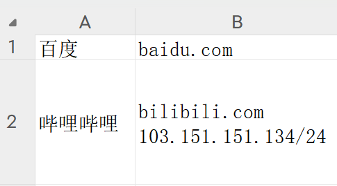

# 项目设计思路与用法

## 1. 目标
资产探测随着安全防护设备的普及，愈发容易被封IP，空间测绘平台用得越来越多，但是很少有汇总常用测绘平台，并完成去重操作，导出结果的工具。

同时，对于测绘平台中大量IP聚集的C段，我希望能自动化二次查询，并汇聚结果、完成二次去重（这里面涉及C段可能会有相对不可信的资产，我希望自动标记出来，根据情况选择是否去做测试）。

写这套东西并不复杂，但是一堆逻辑和数据对应，如果人工写搞得人很烦。目前ai写代码的优势在这里发挥得挺好。小项目+有些麻烦但没有极端复杂的逻辑，用ai写这种工具速度快，稳定性好。所以这里用ai快速完成了这个小工具，方便后续的信息收集工作。

## 2. 用法

### 粗暴说明

配置config.yaml里的api key，把任务丢到targets.csv里面，运行可执行程序即可

第一次运行可执行程序时会自动生成configy.yaml和targets.csv

### 配置

在config.yaml里配置需要的空间策划平台的api key（目前支持quake、fofa、hunter，hunter只做了近三个月的查询，因为省钱）

其他建议根据自身项目情况自行配置的是

```
# 查询参数设置
query:
  min_ips_per_cidr: 10          # 一个C段最少有几个IP才会被二次扫描
  min_urls_per_ip_for_flag: 10  # 同一个IP关联URL超过这个数量，标记为"需要手动扫描"
```

### 任务

在targets.csv中配置如下:

第一列是组织名称，支持中文字符

第二列是组织对应的域名、IP、C段，



### 运行

配置好任务之后直接运行可执行程序即可

### 输出结果

时间戳_step1.csv：针对targets.csv直接查询到的结果（之所以单独导出这个csv，是为了预备任务量特别大，step2运行特别久，起码有一个结果可以先干活儿）

时间戳_step2.csv：针对targets.csv直接查询到的结果+高密度C段扫描结果（主要结果文档）

时间戳_ip_need_scan.csv：高业务量IP，可以考虑做主动端口扫描

### 可信度概述

针对“时间戳_step2.csv”里面的可信度reliability做单独说明：

- reliability=0：根据targets.csv里的域名、IP、C段，通过测绘平台直接得到的结果（阶段1），原生最可信，标记为reliability=0
- reliability=1：根据密集IP所在C段，去测绘平台查询后，如果发现IP是阶段1（reliability=0）里面出现的IP，则认为这个资产高可信，标记为reliability=1
- reliability=2：根据密集IP所在C段，去测绘平台查询后，IP未在阶段1（reliability=0）里面出现的IP，则认为这个资产部分可信，标记为reliability=2

### 使用tips

- 结合excel处理文件，筛选“协议为http、https“且”可信度为0、1“的结果，把url复制出来，可以丢去漏扫、指纹识别、人工挖洞......

- 可以找ai写个脚本，自动化梳理可以暴破弱口令的协议，梳理出来自动化调用密码暴破工具，对这些协议进行弱口令暴力破解

## 3. 整体思路与流程
1. **读取配置**：从`config.yaml`读取各平台API Key、C段阈值、IP业务数量阈值等配置。
2. **记录任务ID**：程序启动时记录当前年月日与时间戳后8位，生成如`20250714_12345678`的任务ID，并在`results`目录下创建对应子目录。
3. **加载目标**：
   - 支持`targets.txt`（仅根域名/IP）或`targets.csv`（第一列为单位代号，第二列为host）。
   - 若为csv，则后续所有数据均带有单位归属（unit_id）。
4. **空间测绘平台查询**：
   - 根据填写的API Key，依次调用各平台（如FOFA、Quake、Hunter等）接口，查询每个host。
   - 每个平台独立实现查询逻辑，返回统一格式。
5. **数据去重与归属**：
   - 以url为主进行去重，规范化处理（去除末尾斜杠、端口归一化等）。
   - url、domain相同，title、status_code等不同则合并（如title合并为“百度;百度一下”）。
   - 360平台如返回path不为""或"/"（360有记录存在实际意义的path的情况），则单独记录为一个url。
   - 备案地址为IP时，domain字段也记录为IP。
   - 所有数据均带有unit_id（如有）、task_id。
   - 首轮数据reliability均为0。
6. **入库**：
   - 推荐采用“单表多字段”方案：所有结果插入同一张表，带有task_id和unit_id字段，便于后续按任务或单位灵活导出和分析。
7. **第一轮导出**：
   - 导出去重后的全部数据为`年月日_时间戳后8位_domain_step1.csv`，保存到本次任务目录。
8. **C段分析与二轮查询**：
   - 统计聚合大量IP的C段（阈值从config.yaml读取），对这些C段做二轮空间测绘查询。
   - 新增结果如未在reliability=0中出现，reliability=2，否则reliability=1。
   - reliability=1的结果如果和reliability=0的结果一致，不能覆盖reliability=0，以更高优先级为准
   - 二轮结果合并入库。
9. **第二轮导出**：
   - reliability=1的结果导出为`年月日_时间戳后8位_cider_step2.csv`。
10. **第三轮导出**：
    - reliability=2的结果导出为`年月日_时间戳后8位_cider_others_step3.csv`。
11. **IP业务数量分析**：
    - 统计每个IP关联的不同url数量（不含path衍生url），超阈值的IP导出为`年月日_时间戳后8位_ip_need_scan.csv`，建议手动端口扫描。


